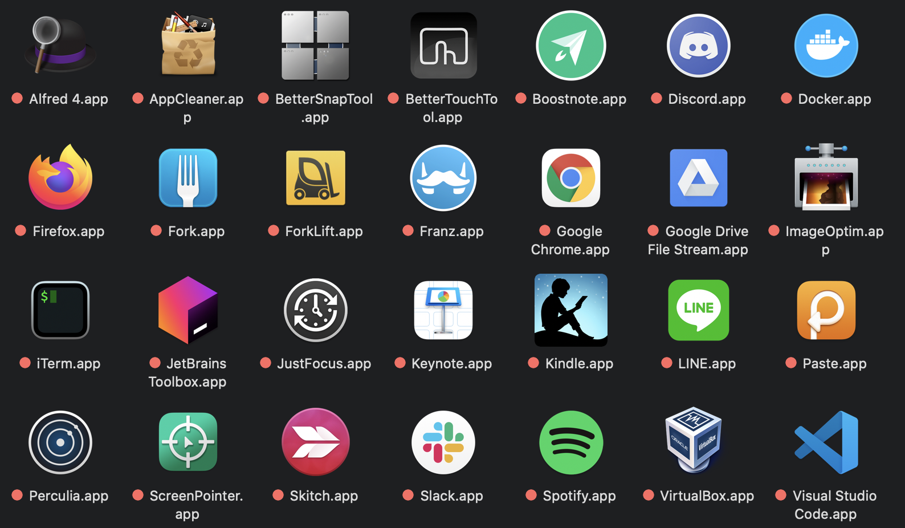
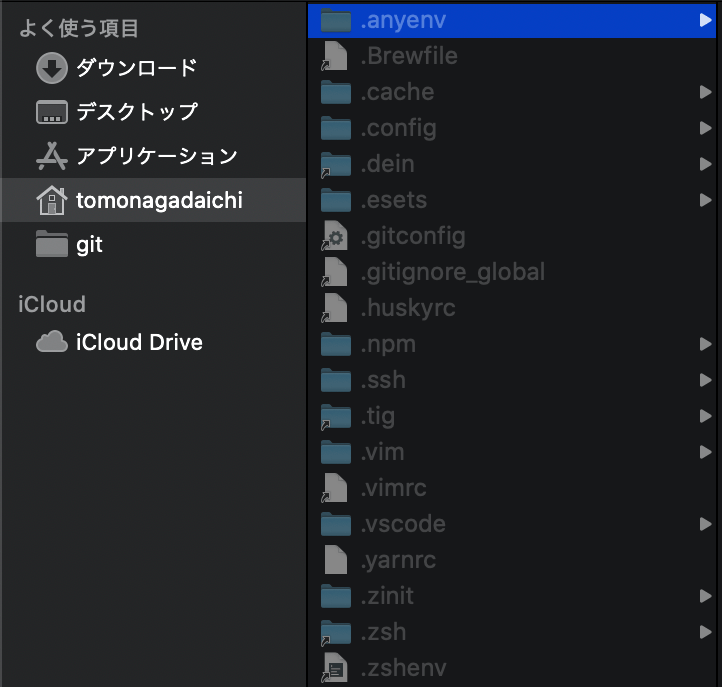

# おれ流爆速Mac環境<br>構築術

2021/01 朝長大地

---

### あけましておめでとうございます！<br>
### 今年もよろしくお願いいたします！🙇‍♂️

---

## 自己紹介

- 朝長 大地（ともなが だいち）
- 勝どきフロントエンドグループ
- 2年ぶりの社内LT
- 今年の抱負 → 新しいことを10個始める

---

# 今日話すこと

---

<!-- .element: data-background-image="dist/asset/white.png" -->

## Macの環境構築が<br>100倍早くなるコツ <!-- .element: class="text-black" -->

---

## 端末セットアップのとき。。

- アプリのインストールが面倒
- アプリの再設定が面倒

---

## やりたいこと

- 必要アプリを一括でDLする
- 端末設定を同期して再設定の手間をなくす

---

<!-- .element: data-background-image="dist/asset/white.png" -->

## Homebrewでアプリを<br>一括インストールしよう！ <!-- .element: class="text-black" -->

---

## [Homebrew](https://brew.sh/index_ja)とは

macOS用のパッケージ管理アプリ。<br>
みんなインストールしているはず。<br>
<br>
```shell
$ brew -v
Homebrew 2.7.1  ## バージョンが表示されればインストール済み
```

---

## brew cask

Macアプリ(パッケージ)をCLIからインストール。

例えばVSCodeの場合
```shell
$ brew install --cask visual-studio-code
```

<br>

[公式](https://formulae.brew.sh/)でインストール可能なアプリを検索可能。

---

 ## brew bundle

Homebrewでインストールした<br>パッケージを管理する機能

```shell
$ brew bundle dump --global --force
```

---

## .Brewfile

`brew install`でインストールした<br>パッケージ一覧ファイルが生成されます。

```shell
tap "homebrew/bundle"
tap "homebrew/cask"
tap "homebrew/cask-versions"
tap "homebrew/core"
brew "coreutils"
brew "ghq"
brew "mas"
brew "peco"
brew "pngquant"
brew "tig"
brew "zsh"
cask "adobe-creative-cloud"
cask "alfred"
cask "appcleaner"
cask "bettertouchtool"
cask "boostnote"
cask "discord"
cask "docker"
cask "firefox"
cask "fork"
cask "forklift"
cask "franz"
cask "google-drive-file-stream"
cask "imageoptim"
cask "iterm2"
cask "jetbrains-toolbox"
cask "kindle"
cask "skitch"
cask "slack"
cask "spotify"
cask "virtualbox"
cask "visual-studio-code"
cask "zeplin"
cask "zoomus"
mas "BetterSnapTool", id: 417375580
mas "LINE", id: 539883307
mas "Paste", id: 967805235
mas "Perculia", id: 1462633284
mas "Keynote", id: 409183694
mas "Just Focus", id: 1142151959
mas "ScreenPointer", id: 1368204906
```

---

## セットアップ時
.Brewfileを新規端末のホームに設置し、<br>以下コマンドを叩く。

```shell
$ brew bundle --global
```

---

<!-- .element: data-background-image="dist/asset/white.png" -->

## .Brewfileの一覧パッケージが<br>一気にインストールされる！ <!-- .element: class="text-black" -->



---

<!-- .element: data-background-image="dist/asset/white.png" -->

## 50倍くらい速くなりましたね。 <!-- .element: class="text-black" -->

---

## 補足

- AppStoresでインストールするアプリは、<br>[mas](https://github.com/mas-cli/mas)というパッケージでインストールしています

---

## 残り50倍速くします。

---

<!-- .element: data-background-image="dist/asset/white.png" -->

## dotfilesで<br>端末設定を管理しよう！ <!-- .element: class="text-black" -->

---

## dotfilesとは

ホームディレクトリに存在する、<br>ドット"."から始まる隠しファイルのこと



---

<!-- .element: data-background-image="dist/asset/white.png" -->

## これをGit管理します <!-- .element: class="text-black" -->

---

## 朝長のdotfiles
https://github.com/smashawk/dotfiles

---

## 同期のやり方

シェルスクリプトを実行して、<br>シンボリックリンクを貼る

```shell
$ git clone https://github.com/smashawk/dotfiles.git

$ cd dotfiles

$ sh/mk_link.sh
```

---

## 注意点

- 業務用端末でicloudやdropboxの使用はNG
- sshなど個人のパスワードファイルの同期もダメ

---

<!-- .element: data-background-image="dist/asset/white.png" -->

## Homebrewとdotfilesで<br>100倍速くなりました！ <!-- .element: class="text-black" -->

---

## おわり

ご静聴ありがとうございました 👻