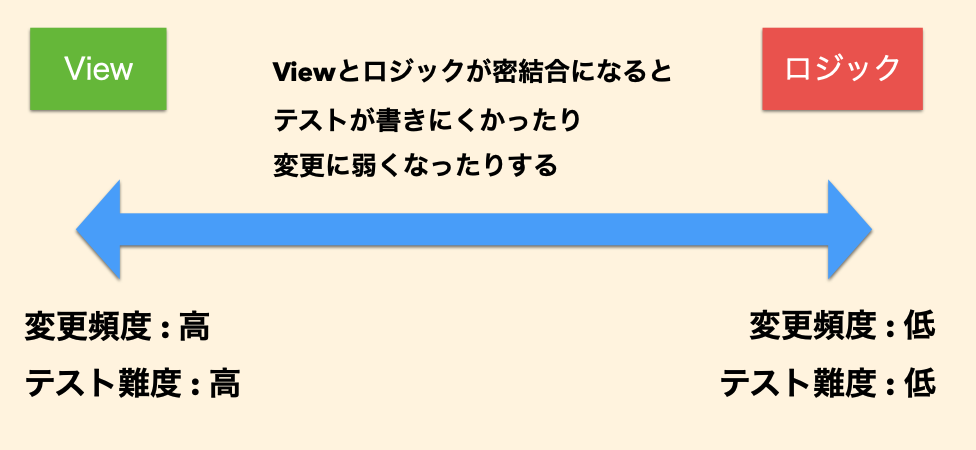
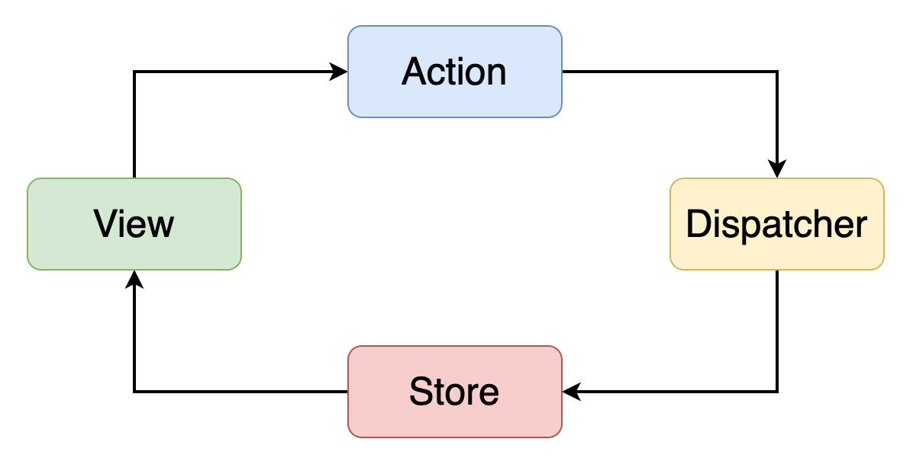
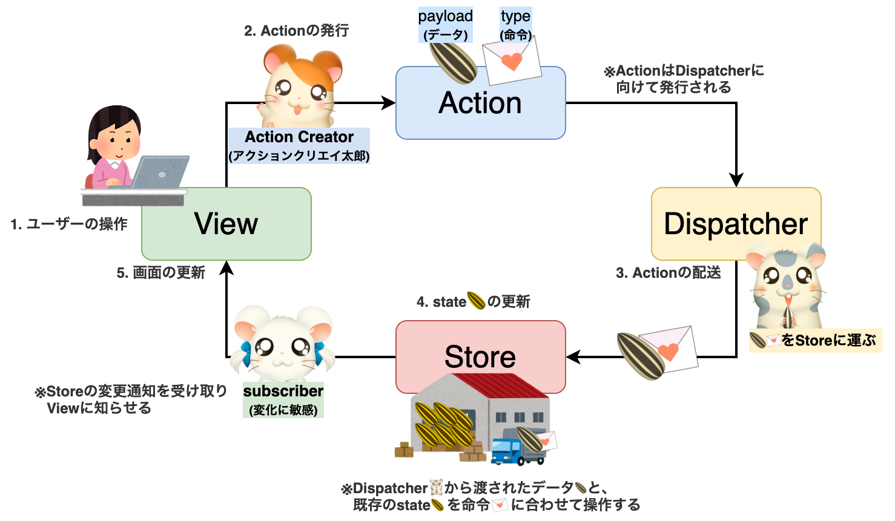
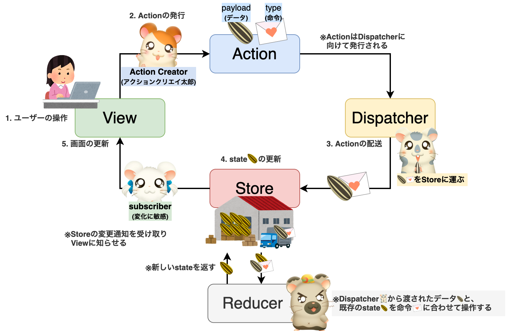

# Todoリスト補講

2021/04 朝長大地

---

### お仕事お疲れさまでした🍵

### もうちょっとだけ頑張りましょう！

---

<!-- .element: data-background-image="../../dist/asset/white.png" -->

## 今日の目標<!-- .element: class="text-black" -->

### 1. 講義の内容をなんとなく理解する<!-- .element: class="text-black" -->
### 2. todoリストをちょっと作ってみる<!-- .element: class="text-black" -->

---

## さっそく本題へ

---

## プログラムというのは、 同じ処理でもいろいろな書き方ができる

---

## 好き勝手に作ったら ぐちゃぐちゃになりがち

---

## だから設計思想が生まれた

[comment]: <> (好き勝手に作ったらぐちゃぐちゃになる→だから思想が大事→今回はアプリケーションを作る→その上で大事なのはViewとLogicの分離→MVCとか具体の話)

---

## いろんな設計思想

- MVC (Model-View-Controller)
- MVVM (Model-View-ViewModel)
- Flux などなど...

---

## アプリケーションを 作るときに大事なこと

---

<!-- .element: data-background-image="../../dist/asset/white.png" -->

## 見た目(View)とロジックを 分離すること<!-- .element: class="text-black" -->

---

## Viewとロジックの分離

 ↑つじけんさんのスライドから引用

---

## いろんな設計思想

- MVC (Model-View-Controller) 
- MVVM (Model-View-ViewModel)
- Flux などなど...

---

## 今日はFluxを使います

---

## Flux

---

###  ストーリーでイメージしてみよう

---

## ハム太郎で理解するFlux

---

## Flux

---

## 今日使うのはFlux + Reducer

---

## Flux + Reducer

---

## イメージできましたか？

---

## 実際のコードを見ながら 確認していきましょう！
