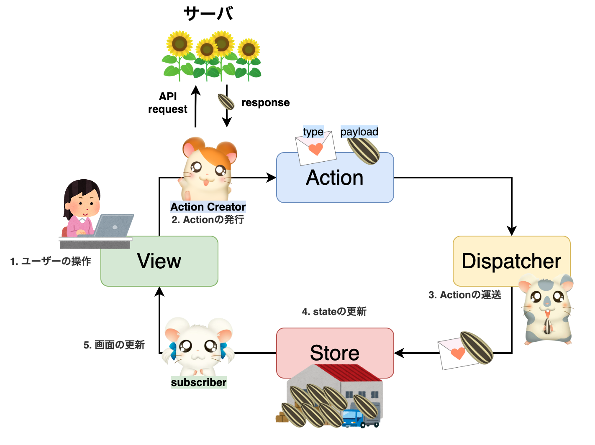

# Todoリスト補講

2021/04/xx 朝長大地

---

# お疲れさまです

---

<!-- .element: data-background-image="../../dist/asset/white.png" -->

## 今日の目標<!-- .element: class="text-black" -->

### スライドの内容をなんとなく理解する<!-- .element: class="text-black" -->
### todoリストをちょっと作ってみる<!-- .element: class="text-black" -->

---

## さっそく本題に入ります

---

## プログラムというのは、 同じ処理でもいろいろな書き方ができます。

---

## 好き勝手に作ったら、 ぐちゃぐちゃになっちゃう

---

## 書き方のルールが必要

[comment]: <> (好き勝手に作ったらぐちゃぐちゃになる→だから思想が大事→今回はアプリケーションを作る→その上で大事なのはViewとLogicの分離→MVCとか具体の話)

---

## 今回はアプリケーションを作る

---

## その上で大事なのはViewとLogicの分離

---

<!-- .element: data-background-image="../../dist/asset/white.png" -->

## 見た目(View)とロジックを 分離すること<!-- .element: class="text-black" -->

---

##  それが一番大事

---

## ここに図をいれる

---

## いろんな思想

- MVC (Model-View-Controller) 
  MVVM (Model-View-ViewModel) 
  Flux
  などなど...

---

## 今日はFluxを使います

---

## ここにFluxの図をいれる

---

###  ストーリーをつけると覚えやすいって東大王が言ってました

---

## ハム太郎で理解するFlux

---

## Flux

---

## 今日使うのはFlux + Reducer

---

## Flux + Reducer

---

## イメージできましたか？

---

## 実際のコードを見ながら 確認していきましょう！
