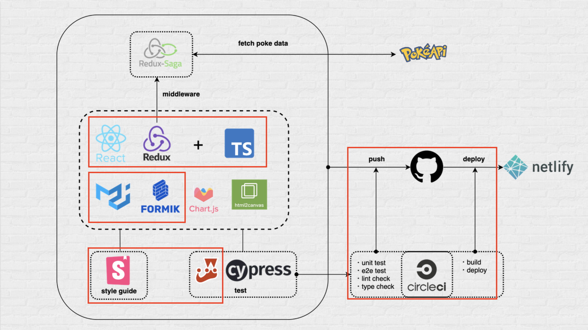

# NIJIBOXで成長する100の方法
## 〜ポケモン図鑑を添えて〜

2021/04/06 朝長大地

---

## 自己紹介

- 朝長 大地（ともなが だいち）
- 勝どきフロントエンドグループ

---

## まずはこちらをご覧ください

https://laughing-cray-9d5255.netlify.app/

---

## というものを作ったんですけど

---

## 本題は別にあります

---

# 今日話すこと

---

<!-- .element: data-background-image="../../dist/asset/white.png" -->

##  NIJIBOXで成長する100の方法<!-- .element: class="text-black" -->

---

## タイトルは盛っとけって偉い人が言ってました

---

## ~NIJIBOXで成長する100の方法~
## NIJIBOXで成長する3つの方法

---

## ここからは個人の意見です

---

<!-- .element: data-background-image="../../dist/asset/white.png" -->

## ① 成長機会提供の場を活用する<!-- .element: class="text-black" -->

---

## 社内の取り組み いろいろありますね

- 勝どき新人研修
- ICS池田さん勉強会
- スピードハッカソン
- JS/TS BootCamp
- LT
- Qiita、ブログ

---

## 発表資料や記事には、 知識・経験が詰まっています

---

## ありがたく全部活用しましょう

---

## NARUTO理論
自分以外の人の知見を吸収することで、 擬似的な分身修行ができる

---

<!-- .element: data-background-image="../../dist/asset/white.png" -->

## ② 今できることをやる<!-- .element: class="text-black" -->

---

### ポケモン図鑑には、 今やってる案件の技術全部いれました

---

<!-- .element: data-background-image="../../dist/asset/white.png" -->

## ③ アウトプットをする<!-- .element: class="text-black" -->

---

## ありがたく全部使った後は、 今度は自分で提供しましょう

---

## 例えば

- 業務で得た知見・経験
- 自己開発の成果

---

### 自分の経験したことを 自分の言葉で発信することが大事

>あなたの経験はあなたが一次情報源だ。
> 実際に何かをやったということは思っている以上に貴重なことなのだ。

[情報ではなく経験をアウトプットすること](https://lacolaco.hatenablog.com/entry/2021/03/08/100228)

---

## それぞれ常駐先も違う やってる案件も違う 使ってる技術も違う

---

## それ全部 NARUTO理論で吸収すれば

---

## 最強のチームにならない？

---

## timesとかでも

今期の目標はtimesをもっと活用するです。。

---

<!-- .element: data-background-image="../../dist/asset/white.png" -->

## まとめ<!-- .element: class="text-black" -->

### ① 成長機会提供の場を活用する<!-- .element: class="text-black" -->
### ② 今できることをやる<!-- .element: class="text-black" -->
### ③ アウトプットをする<!-- .element: class="text-black" -->

---

## おまけ

---

## ポケモン図鑑を作る上で、 参考にした記事をまとめました

---

## 前提

公式を読むのは絶対です。

---

<!-- .element: class="top0" -->

### JavaScript基本・ES6とか

|参考にしたもの|コメント|
|---|---|
|[ちょっと高度なJavaScriptの話](https://qiita.com/renesisu727/items/0447fce8a9e00817f1f5)||
|[存在と無 NIJIBOXのサルトルと学ぶJavaScriptの存在判定](https://docs.google.com/presentation/d/15JDUDB9_wmooqEeMIEa_THBkvvacxAdLHv4eOtpR2mQ/edit?usp=sharing)|文くんのLTスライド|
|||
|||
|||

---

<!-- .element: class="top0" -->

### React・Redux基礎

公式だけでわりといける<!-- .element: class="top0" -->

|参考にしたもの|コメント|
|---|---|
|[りあクト！ - BOOTH](https://oukayuka.booth.pm/)|みんなオススメReact書籍|
|[今から始めるReact入門 〜 React Router](https://qiita.com/TsutomuNakamura/items/34a7339a05bb5fd697f2)||
|[20210209_CustomHooks](https://drive.google.com/file/d/1CCmGR9wG9jK-LLIcrC14lkTuOjVHqix_/view?usp=sharing)|中野監督のLT記事。|
|||

---

<!-- .element: class="top0" -->

### TypeScript

|参考にしたもの|コメント|
|---|---|
|[TypeScriptの型入門](https://qiita.com/uhyo/items/e2fdef2d3236b9bfe74a)|入門といいつつかなり細かく載ってる。リファレンスとして使うのが良さそう|
|[【TypeScript】Utility Typesをまとめて理解する](https://qiita.com/k-penguin-sato/items/e2791d7a57e96f6144e5)|これもリファレンスとして使ってる|
|[敗北者のTypeScript](https://qiita.com/uhyo/items/aae57ba0734e36ee846a)||
|[bootcamp_2021_ts_nbx](https://discord.com/channels/811759359939051530/818305146571456513/819375649264631828)|TS研修のスライド。|

---

<!-- .element: class="top0" -->

### 非同期通信

|参考にしたもの|コメント|
|---|---|
|[20200831_JavaScriptの非同期処について_菊池初実.pdf](https://drive.google.com/file/d/1CH68zqRbvqxF57mEVS1QViFtoy0Banhj/view?usp=sharing)|菊池さんのLT記事。|

---

<!-- .element: class="top0" -->

### StoryBook

v5とv6で書き方が大幅に変わるので注意<!-- .element: class="top0" -->

|参考にしたもの|コメント|
|---|---|
|[20210209_AtomicDesignとStorybookでコンポーネント管理](https://drive.google.com/file/d/1y03wOZV6eC9byout4mYtFV_CXltOxdhT/view?usp=sharing)|菅野くんのLT記事。|
|[Vue と CSF によるモダンな Storybook 6 のはじめかた](https://zenn.dev/sa2knight/books/aca5d5e021dd10262bb9)|Vueの記事だけど、v6の記事が少ないのでめちゃ助かる。|
|[Storybook のアップデート](https://mokajima.com/updating-storybook/)|これもv6の記事。|

---

<!-- .element: class="top0" -->

### 単体Test(Jest)

|参考にしたもの|コメント|
|---|---|
|||
|[Facebook製のJavaScriptテストツール「Jest」の逆引き使用例](https://qiita.com/chimame/items/e97883fd46b67529d59f)|公式と合わせてリファレンスとして使える。|
|[Jestのカバレッジはどのように見ればよいのだろうか？](https://qiita.com/s_karuta/items/c464f220a4b65f70f214)|カバレッジ|

---

<!-- .element: class="top0" -->

### E2ETest(Cypress)

|参考にしたもの|コメント|
|---|---|
|[autify を使ってみて.pptx](https://drive.google.com/file/d/1KMf3Lx7gsR47W3r3wKiELtctSwyYWDru/view?usp=sharing)|折田くんのLT記事。|
|[Cypressで始めるReactのE2Eテスト-導入から実際にテストを書いてみよう！](https://blog.microcms.io/cypress-react-e2e/)|この通りやればテストできる。|
|[GUIテストツール一覧](https://qiita.com/jun2014/items/8cabbd52830904af49af)|E2Eテストの|

---

<!-- .element: class="top0" -->

### CI/CDツール(Circle Ci)

|参考にしたもの|コメント|
|---|---|
|[いまさらだけどCircleCIに入門したので分かりやすくまとめてみた](https://qiita.com/gold-kou/items/4c7e62434af455e977c2)||
|[Jestを通してCircleCIの基本を確認してみる](https://dev.classmethod.jp/articles/circleci-getting-started-jest/)||
|[Netlify へ CLI デプロイで、CI/CD する](https://riotz.works/articles/lulzneko/2019/09/23/deploy-to-netlify-via-cli-for-cicd/)||
|[CircleCIでテストとビルドを実行し、Netlifyにデプロイする。](https://qiita.com/Sakaki-Ya/items/7064903e5698407b329b)||
|[CircleCI Orbが最高だった件](https://buildersbox.corp-sansan.com/entry/2021/01/07/110000)||

---

<!-- .element: class="top0" -->

### パフォーマンス

|参考にしたもの|コメント|
|---|---|
|[React最適化〜useMemoやReact.lazyなど、一歩進んだReactの知識〜](https://drive.google.com/drive/u/0/folders/1cyB4C16FWgkCpXkdmJXGbzfogYMG2JLz)|ICS池田さんの動画。|
|[React製のSPAのパフォーマンスチューニング実例](https://recruit-tech.co.jp/blog/2018/09/19/react_spa_performance_tuning/)|つじけんさんの記事。まずはじめに読もう。|
|[Before You memo()](https://overreacted.io/before-you-memo/)|Dan氏の記事。メモ化する前にやるべきことあるよ。|
|[Reactのレンダリングに関する完全ガイド](https://qiita.com/hellokenta/items/6b795501a0a8921bb6b5)|めちゃ分かりやすくて細かい記事。まさに完全ガイド。|
|[お前らのReactは遅い](https://qiita.com/teradonburi/items/5b8f79d26e1b319ac44f)||
|[useCallbackはとにかく使え！　特にカスタムフックでは](https://blog.uhy.ooo/entry/2021-02-23/usecallback-custom-hooks/)|責務の分離に焦点を当てた記事。|

---

<!-- .element: class="top0" -->

### 英語でコミットとか関数名とか

|参考にしたもの|コメント|
|---|---|
|[awesome-commit-english](https://github.com/azu/awesome-commit-english)|英語メッセージの記事まとめ集。ここから結構探した。|
|[gitにおけるコミットログ/メッセージ例文集100](https://anond.hatelabo.jp/20160725092419)|例文をアレンジして使いやすい|
|[GitHubで使われている実用英語コメント集](https://qiita.com/shikichee/items/a5f922a3ef3aa58a1839)|頻出単語と使い方が揃ってるので、これだけでも十分使える|
|[関数名によく使われる英単語（動詞）の意味とニュアンス](https://php-archive.net/php/words-in-function-names/)|関数名に困った時は、よくこの中から探す|
|[プログラミングでよく使う英単語のまとめ【随時更新】](https://qiita.com/Ted-HM/items/7dde25dcffae4cdc7923)|昔のメモから発見した。記事更新も続いてるしかなり使えそう|