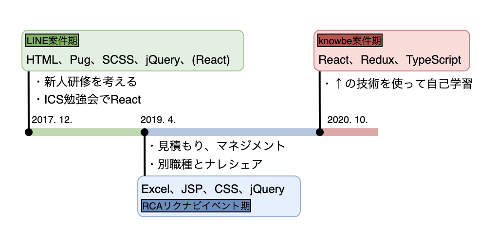
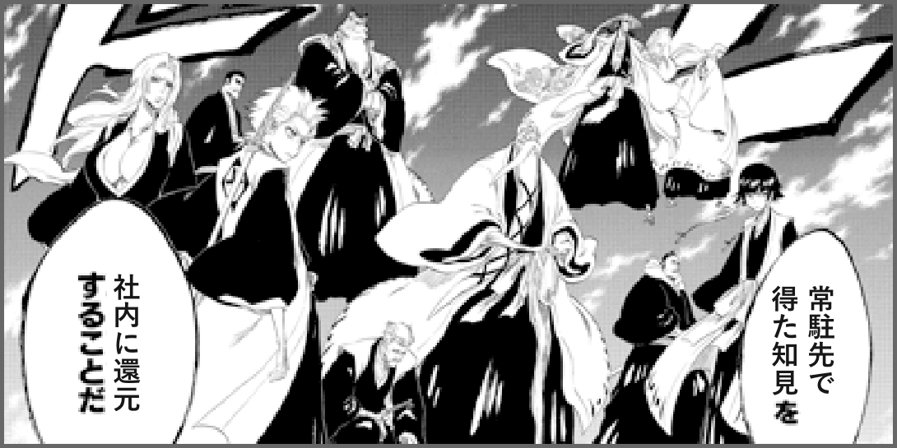

# NIJIBOXで成長する100の方法
## 〜ポケモン図鑑を添えて〜

2021/04/06 朝長大地

---

## 自己紹介

- 朝長 大地（ともなが だいち）
- 勝どきフロントエンドグループ
- 暇さえあればYoutube見てる
- プロ野球が開幕して楽しい

---

## まずはこちらをご覧ください

https://laughing-cray-9d5255.netlify.app/

---

## というものを作ったんですけど

---

## 本題は別にあります

---

# 今日話すこと

---

<!-- .element: data-background-image="../../dist/asset/white.png" -->

##  NIJIBOXで成長する100の方法<!-- .element: class="text-black" -->

---

## タイトルは盛っとけって偉い人が言ってました

---

## ~NIJIBOXで成長する100の方法~<!-- .element: class="text-gray" -->
## のうちの3つの方法

---

## ここからは個人の意見です

---

<!-- .element: data-background-image="../../dist/asset/white.png" -->

## ① 成長機会の場を活用する<!-- .element: class="text-black" -->

---

## 社内の取り組み いろいろありますね

- 勝どき新人研修
- ICS池田さん勉強会
- スピードハッカソン
- JS/TS BootCamp
- LT
- Qiita、ブログ

---

## ありがたく全部活用しましょう

---

## 発表資料や記事には、 知識・経験が詰まっています

---

## ありがたく全部活用しましょう

---

## NARUTO理論
自分以外の人の知見を吸収することで 擬似的な時間短縮分身修行ができるという理論

---

<!-- .element: data-background-image="../../dist/asset/white.png" -->

## ② 今できることをやる<!-- .element: class="text-black" -->

---

## とはいえ いろんな事情があると思います

---

## 今いる場所、 今与えられた環境で、 今できることをやりましょう

---

>現在の職務に全力で臨まない人に、 投資しようと思わない。

*[情熱プログラマー ソフトウェア開発者の幸せな生き方](https://www.amazon.co.jp/%E6%83%85%E7%86%B1%E3%83%97%E3%83%AD%E3%82%B0%E3%83%A9%E3%83%9E%E3%83%BC-%E3%82%BD%E3%83%95%E3%83%88%E3%82%A6%E3%82%A7%E3%82%A2%E9%96%8B%E7%99%BA%E8%80%85%E3%81%AE%E5%B9%B8%E3%81%9B%E3%81%AA%E7%94%9F%E3%81%8D%E6%96%B9-%EF%BC%A3%EF%BD%88%EF%BD%81%EF%BD%84%EF%BC%A6%EF%BD%8F%EF%BD%97%EF%BD%8C%EF%BD%85%EF%BD%92-ebook/dp/B01IGW5MQ0/ref=sr_1_1?adgrpid=102902611583&dchild=1&gclid=CjwKCAjwu5CDBhB9EiwA0w6sLdK05gpLHgRCycLmNXIriv0WW7Hp0kcjXJ26HGFJ9msNAJjeMqbeEBoCl2QQAvD_BwE&hvadid=448183733445&hvdev=c&hvlocphy=1009250&hvnetw=g&hvqmt=e&hvrand=12865339474210129604&hvtargid=kwd-333776599909&hydadcr=15817_11177326&jp-ad-ap=0&keywords=%E6%83%85%E7%86%B1%E3%83%97%E3%83%AD%E3%82%B0%E3%83%A9%E3%83%9E%E3%83%BC&qid=1617206347&sr=8-1)*

---

## できることをやってきた

---

### ポケモン図鑑には、 今やってる案件の技術全部いれました

---

<!-- .element: data-background-image="../../dist/asset/white.png" -->

## ③ アウトプットをする<!-- .element: class="text-black" -->

---

## ありがたく全部使った後は、 今度は自分で提供しましょう

---

## 例えば

- 業務で得た知見・経験・考え方
- 自己開発の成果
- 頑張ったこと、苦労したこと

[comment]: <> (---)

[comment]: <> (### 自分の経験したことを 自分の言葉で発信することが大事)

[comment]: <> (>あなたの経験はあなたが一次情報源だ。 実際に何かをやったということは思っている以上に貴重なことなのだ。)

[comment]: <> (*[情報ではなく経験をアウトプットすること]&#40;https://lacolaco.hatenablog.com/entry/2021/03/08/100228&#41;*)

---

## それぞれ常駐先も違う やってる案件も違う 使ってる技術も違う

---

## それ全部 NARUTO理論で吸収すれば

---

## 最強の組織にならない？

---

<!-- .element: data-background-image="../../dist/asset/white.png" -->

## まとめ<!-- .element: class="text-black" -->

### ① 成長機会の場を活用する<!-- .element: class="text-black" -->
### ② 今できることをやる<!-- .element: class="text-black" -->
### ③ アウトプットをする<!-- .element: class="text-black" -->

---

### 発表は以上です

### ご静聴ありがとうございました👻

---

## 以下おまけページ

---

## ポケモン図鑑を作る上で、 参考にした記事をまとめました

---

## 前提

公式を読むのは絶対です。

---

<!-- .element: class="top0" -->

### React・Redux基礎

公式だけでわりといける<!-- .element: class="top0" -->

|参考にしたもの|コメント|
|---|---|
|[りあクト！ - BOOTH](https://oukayuka.booth.pm/)|みんなオススメReact書籍。技術だけでなく、歴史も書いてあるのが面白い。|
|[React Redux の難しかった点をできるだけシンプルに図解](https://qiita.com/suzukenz/items/40afe717029c2f8f4a54)|Reduxの解説記事の中で、一番シンプルにまとまってて頭に入りやすいと思う。|
|[ReduxのFAQを読み直す](https://qiita.com/terrierscript/items/26bc85626bcdc4963331)|公式と合わせて読むべし。|
|[20210209_CustomHooks](https://drive.google.com/file/d/1CCmGR9wG9jK-LLIcrC14lkTuOjVHqix_/view?usp=sharing)|中野監督のLT記事。読むとCustomHooksを使ってみたくなる。|
|[今から始めるReact入門 〜 React Router](https://qiita.com/TsutomuNakamura/items/34a7339a05bb5fd697f2)|React Routerを使うときは、この記事から見ると良さそう。|

---

<!-- .element: class="top0" -->

### TypeScript

|参考にしたもの|コメント|
|---|---|
|[TypeScriptの型入門](https://qiita.com/uhyo/items/e2fdef2d3236b9bfe74a)|入門といいつつかなり細かく載ってる。リファレンスとして使うのが良さそう|
|[【TypeScript】Utility Typesをまとめて理解する](https://qiita.com/k-penguin-sato/items/e2791d7a57e96f6144e5)|これもリファレンスとして使ってる。|
|[敗北者のTypeScript](https://qiita.com/uhyo/items/aae57ba0734e36ee846a)|anyにを使ったら負け。理にかなっていて個人的に好きな記事。|
|[bootcamp_2021_ts_nbx](https://discord.com/channels/811759359939051530/818305146571456513/819375649264631828)|TS研修のスライド。今分からなくても定期的に見直すと分ることも増えてくるはず。|

---

<!-- .element: class="top0" -->

### Storybook

v5とv6で書き方が大幅に変わるので注意<!-- .element: class="top0" -->

|参考にしたもの|コメント|
|---|---|
|[20210209_AtomicDesignとStorybookでコンポーネント管理](https://drive.google.com/file/d/1y03wOZV6eC9byout4mYtFV_CXltOxdhT/view?usp=sharing)|菅野くんのLT記事。これを読んで考え方を理解しよう。|
|[Vue と CSF によるモダンな Storybook 6 のはじめかた](https://zenn.dev/sa2knight/books/aca5d5e021dd10262bb9)|Vueの記事だけど、v6の記事が少ないのでめちゃ助かる。|
|[Storybook のアップデート](https://mokajima.com/updating-storybook/)|これもv6の記事。|
|[Storybook でアクセシビリティの自動チェック](https://qiita.com/kalbeekatz/items/2570c0d3cde76dd70e75)|軽部くんの記事。アクセシビリティチェックにはこれを使おう。|

---

<!-- .element: class="top0" -->

### Test

|参考にしたもの|コメント|
|---|---|
|[Facebook製のJavaScriptテストツール「Jest」の逆引き使用例](https://qiita.com/chimame/items/e97883fd46b67529d59f)|公式と合わせてリファレンスとして使える。便利。|
|[Jestのカバレッジはどのように見ればよいのだろうか？](https://qiita.com/s_karuta/items/c464f220a4b65f70f214)|カバレッジの意味分からん〜と思ったときに。まさに知りたいことが書いてあった。|
|[Cypressで始めるReactのE2Eテスト-導入から実際にテストを書いてみよう！](https://blog.microcms.io/cypress-react-e2e/)|この通りやればCypressのテストはできる。|
|[autify を使ってみて.pptx](https://drive.google.com/file/d/1KMf3Lx7gsR47W3r3wKiELtctSwyYWDru/view?usp=sharing)|折田くんのLT記事。Autify使ってみたい。|
|[GUIテストツール一覧](https://qiita.com/jun2014/items/8cabbd52830904af49af)|E2Eテストに使えるツール集。ここからどれを使うか考えることができる。|---

---

<!-- .element: class="top0" -->

### CI/CDツール(Circle Ci)

|参考にしたもの|コメント|
|---|---|
|[いまさらだけどCircleCIに入門したので分かりやすくまとめてみた](https://qiita.com/gold-kou/items/4c7e62434af455e977c2)|探した中で一番詳しい記事。まずはこれ。|
|[Jestを通してCircleCIの基本を確認してみる](https://dev.classmethod.jp/articles/circleci-getting-started-jest/)|↑の記事と合わせたらCircleCi基本は網羅できる。|
|[Netlify へ CLI デプロイで、CI/CD する](https://riotz.works/articles/lulzneko/2019/09/23/deploy-to-netlify-via-cli-for-cicd/)|Netlifyと連携する場合に参考になる。|
|[CircleCI Orbが最高だった件](https://buildersbox.corp-sansan.com/entry/2021/01/07/110000)|CypressのE2EテストにOrbを使った。結論Orb最高。|

---

<!-- .element: class="top0" -->

### パフォーマンス

|参考にしたもの|コメント|
|---|---|
|[React最適化〜useMemoやReact.lazyなど、一歩進んだReactの知識〜](https://drive.google.com/drive/u/0/folders/1cyB4C16FWgkCpXkdmJXGbzfogYMG2JLz)|ICS池田さんの動画。見ない理由がない。|
|[React製のSPAのパフォーマンスチューニング実例](https://recruit-tech.co.jp/blog/2018/09/19/react_spa_performance_tuning/)|つじけんさんの記事。まずはじめに読もう。|
|[Before You memo()](https://overreacted.io/before-you-memo/)|Dan氏の記事。メモ化する前にやるべきことあるよ。|
|[Reactのレンダリングに関する完全ガイド](https://qiita.com/hellokenta/items/6b795501a0a8921bb6b5)|めちゃ分かりやすくて細かい記事。まさに完全ガイド。|
|[お前らのReactは遅い](https://qiita.com/teradonburi/items/5b8f79d26e1b319ac44f)|↑の記事と合わせて読むとより理解が深まる。|
|[useCallbackはとにかく使え！　特にカスタムフックでは](https://blog.uhy.ooo/entry/2021-02-23/usecallback-custom-hooks/)|責務の分離に焦点を当てた記事。|

---

<!-- .element: class="top0" -->

### 英語でコミットとか関数名とか

|参考にしたもの|コメント|
|---|---|
|[awesome-commit-english](https://github.com/azu/awesome-commit-english)|英語メッセージの記事まとめ集。ここから結構探した。|
|[gitにおけるコミットログ/メッセージ例文集100](https://anond.hatelabo.jp/20160725092419)|例文をアレンジして使いやすい。|
|[GitHubで使われている実用英語コメント集](https://qiita.com/shikichee/items/a5f922a3ef3aa58a1839)|頻出単語と使い方が揃ってるので、これだけでも十分使える。|
|[関数名によく使われる英単語（動詞）の意味とニュアンス](https://php-archive.net/php/words-in-function-names/)|関数名に困った時は、よくこの中から探す。|
|[プログラミングでよく使う英単語のまとめ【随時更新】](https://qiita.com/Ted-HM/items/7dde25dcffae4cdc7923)|昔のメモから発見した。記事更新も続いてるしかなり使えそう。|